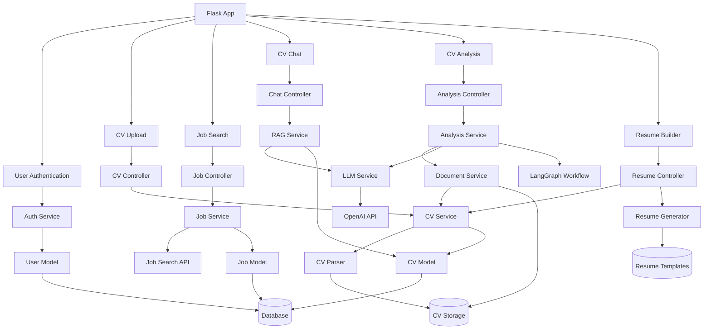

# INU Grow App

**INU Grow** is a Flask-based web application designed to assist job seekers in optimizing their CVs and job applications using AI-powered tools. It offers CV analysis, job matching, optimization, and more.

---

## 🚀 Features

- **CV Analysis**: Evaluates CVs for ATS compatibility, keyword optimization, and competitive fit.
- **Job Matching**: Compares CV skills to job descriptions, providing match percentages (technical, soft, weighted).
- **CV Optimization**: Generates an optimized CV tailored to a job description.
- **Cover Letter Generation**: Creates personalized cover letters.
- **Job Search**: Mock job search functionality (to be replaced with a real API).
- **Chat with CV**: Query your CV content using a RAG-based chat system.
- **User Authentication**: Secure registration and login with Flask-Login.
- **Resume Builder**: Interactive tool to create professional resumes with multiple templates.
- **AI-Assisted Editing**: Get AI help to improve resume sections.

---

## 📦 Prerequisites

- Python 3.13+
- Git (optional, for version control)

---

## 🛠️ Setup

### 1. Navigate to the Project Directory

```bash
cd /Users/anjanisharma/projects/inu_grow_app
```

### 2. Create and Activate a Virtual Environment

```bash
python -m venv venv
source venv/bin/activate  # macOS/Linux
# venv\Scripts\activate   # Windows
```

### 3. Install Dependencies

```bash
pip install -r requirements.txt
```

Alternatively, install core dependencies manually:

```bash
pip install flask flask-login flask-sqlalchemy flask-migrate werkzeug langchain-openai sentence-transformers faiss-cpu reportlab pymupdf python-docx python-dotenv
```

### 4. Set Up Environment Variables

Create a `.env` file in the root directory with the following content:

```env
OPENAI_API_KEY=your-openai-api-key-here
```

> 🔐 Replace `your-openai-api-key-here` with your actual OpenAI API key.

### 5. Run the App

```bash
python app.py
```

Then, open your browser and visit: [http://localhost:5000](http://localhost:5000)

---

## 🧪 Usage

1. **Register/Login**: Create an account at `/register`, then log in at `/login`.
2. **Analyze CV**: Go to `/analyze`, upload a CV (PDF/DOCX), and enter a job description.
3. **View Results**: See match scores, optimized CV, and cover letter at `/results`.
4. **Job Search**: Use `/job_search` to search jobs (mock data for now).
5. **Chat**: Ask questions about your CV at `/chat`.
6. **Logout**: End your session via the "Logout" link.

---

## 🗂️ Project Structure

```
inu_grow_app/
├── .env                  # API keys (ignored by Git)
├── .gitignore            # Files to ignore in Git
├── README.md             # Project documentation
├── app.py                # Flask application entry point, route registration
├── init_db.py            # Script to initialize and seed the database
├── alembic.ini           # Alembic configuration for database migrations
├── config/               # Configuration
│   ├── __init__.py       # Python package indicator
│   └── config.py         # App configuration settings (database, paths, secrets)
├── controllers/          # HTTP request handlers
│   ├── __init__.py       # Python package indicator
│   ├── auth_controller.py      # Authentication routes (register, login, logout)
│   ├── analysis_controller.py  # CV analysis routes (analyze, results display)
│   ├── chat_controller.py      # CV chat functionality for Q&A on CVs
│   ├── cv_controller.py        # CV upload, deletion, and management
│   ├── index_controller.py     # Main landing page, navigation
│   ├── job_controller.py       # Job search and job detail routes
│   └── resume_controller.py    # Resume builder and template functionality
├── models/               # Database models (SQLAlchemy)
│   ├── __init__.py       # Initializes SQLAlchemy and imports models
│   ├── cv.py             # CV model (stores CV data and metadata)
│   ├── job.py            # Job description model (job listings)
│   └── user.py           # User account model (auth, profiles)
├── services/             # Business logic layer
│   ├── __init__.py       # Python package indicator  
│   ├── analysis_service.py     # CV-to-job matching, optimization, scoring
│   ├── auth_service.py         # User authentication and session management
│   ├── cv_service.py           # CV parsing, storage, and retrieval
│   ├── document_service.py     # PDF/DOCX handling, text extraction
│   ├── job_service.py          # Job search and recommendation logic
│   ├── llm_service.py          # OpenAI API integration and prompt handling
│   └── rag_service.py          # Retrieval-Augmented Generation for CV chat
├── utils/                # Utility functions and classes
│   ├── __init__.py       # Python package indicator
│   ├── cv_parser.py          # Basic CV parsing with section recognition
│   ├── enhanced_cv_parser.py # Advanced CV parsing with better skill extraction
│   └── workflow.py           # LangGraph workflow for structured CV analysis
├── static/               # Static assets served directly
│   ├── images/           # App logos and feature icons
│   │   ├── analysis-icon.png   # Feature icon for analysis
│   │   ├── coach-icon.png      # Feature icon for coaching
│   │   ├── cover-icon.png      # Feature icon for cover letters
│   │   ├── cv-icon.png         # Feature icon for CV upload
│   │   ├── inu-grow.png        # Main application logo
│   │   ├── search-icon.png     # Feature icon for job search
│   │   └── ...                 # Other brand imagery
│   └── style.css         # Main application stylesheet
├── templates/            # Jinja2 HTML templates
│   ├── base.html         # Base template with navigation and layout
│   ├── index.html        # Home page template
│   ├── register.html     # User registration form
│   ├── login.html        # User login form
│   ├── analyze.html      # CV analysis interface with job input
│   ├── results.html      # Analysis results display with visualizations
│   ├── preview_cv.html   # CV content preview
│   ├── job_desc.html     # Job description detail view
│   ├── job_search.html   # Job search interface
│   ├── chat.html         # Chat interface for CV questions
│   ├── upload_cv.html    # CV upload interface
│   └── resume_builder.html # Resume customization and generation
├── instance/             # Instance-specific files (not in version control)
│   └── database.db       # SQLite database file
├── migrations/           # Alembic database migrations
│   ├── README            # Migration usage instructions
│   ├── alembic.ini       # Alembic configuration
│   ├── env.py            # Migration environment setup
│   ├── script.py.mako    # Migration script template
│   └── versions/         # Migration version scripts
│       └── ca4c6b2cccb8_add_summary_column_to_cv.py # Example migration
├── notebooks/            # Jupyter notebooks for testing and development
│   └── cv_parser_test.ipynb # Testing notebook for CV parser
└── uploads/              # Storage for uploaded user files (ignored by Git)
    └── temp/             # Temporary storage for generated files
```

## 📊 Application Flow Diagram



## 📄 File Descriptions

### Core Files
- **app.py**: Application entry point that initializes Flask, registers blueprints, and starts the server
- **init_db.py**: Script to initialize and seed the database with initial data
- **alembic.ini**: Configuration for Alembic database migration tool
- **requirements.txt**: List of Python package dependencies

### Configuration
- **config/config.py**: Contains application settings including database connection, secret keys, and environment-specific configs

### Controllers
- **auth_controller.py**: Handles user registration, login, and authentication
- **analysis_controller.py**: Processes CV analysis requests and returns results
- **chat_controller.py**: Manages the interactive chat with CV feature
- **cv_controller.py**: Controls CV upload, storage, and retrieval
- **index_controller.py**: Serves the main landing page
- **job_controller.py**: Manages job search and job description handling
- **resume_controller.py**: Handles resume builder functionality and template generation

### Models
- **user.py**: User account data model
- **cv.py**: CV storage and metadata model
- **job.py**: Job description storage model

### Services
- **analysis_service.py**: Core logic for analyzing CVs against job descriptions
- **auth_service.py**: User authentication business logic
- **cv_service.py**: CV processing and management
- **document_service.py**: Generic document handling (PDF, DOCX)
- **job_service.py**: Job search and processing
- **llm_service.py**: Interface to LLM APIs (OpenAI)
- **rag_service.py**: Retrieval-Augmented Generation for CV chat

### Utils
- **cv_parser.py**: Basic CV parsing functionality
- **enhanced_cv_parser.py**: Improved CV parsing with better skill and section extraction
- **workflow.py**: Defines LangGraph workflow for CV analysis

### Resume Builder
- **resume_generator.py**: Creates formatted resumes in different templates
- **resume_parser.py**: Parses and structures resume content for template generation
- **templates/**: HTML templates for resume designs

### Templates & Static
- **templates/**: HTML templates for each application view including the new resume_builder.html
- **static/**: CSS stylesheets and image assets including new INU Grow branding

---

## 🧰 Technologies Used

- **Framework**: Flask, Flask-Login, Flask-SQLAlchemy, Flask-Migrate
- **AI & LLM**: LangChain (OpenAI integration), LangGraph for workflow orchestration
- **Vector Search**: Sentence-Transformers & FAISS (RAG implementation)
- **Document Processing**: ReportLab & PyMuPDF (PDF handling), python-docx
- **Front-end**: Bootstrap (Styling), Font Awesome (Icons), HTML/CSS/JavaScript
- **Architecture**: MVC-like pattern with Services layer
- **Database**: SQLite (development), with Alembic for migrations

---

## 💻 Development

To contribute or modify the app:

### Initialize Git

```bash
git init
git add .
git commit -m "Initial commit"
```

### Create a Branch

```bash
git checkout -b feature/your-feature
```

### Commit Changes

```bash
git commit -m "Your change description"
```

### Adding New Features

When adding new features, follow these guidelines:

1. **Controllers**: Add your route handlers to the appropriate controller or create a new one if needed.
2. **Services**: Implement business logic in service classes that can be injected into controllers.
3. **Templates**: Add new templates in the templates directory, extending base.html.
4. **Testing**: Test your features thoroughly before committing.

For example, to add a new feature that analyzes education sections in CVs:
- Create or update methods in `services/cv_service.py`
- Add route handlers in `controllers/cv_controller.py`
- Update templates as needed
- Ensure appropriate database models exist in the models directory

---

## 🔄 Common Workflows

### CV Analysis Workflow
1. User uploads CV (PDF/DOCX)
2. User enters or selects a job description
3. System parses and extracts CV content
4. LLM analyzes CV against job description
5. System generates match scores and optimization recommendations
6. User receives detailed analysis report

### Resume Builder Workflow
1. User selects one of their uploaded CVs
2. User chooses a resume template (Modern, Professional, Technical)
3. System pre-fills resume content from the parsed CV data
4. User can customize sections, highlight skills, and toggle section visibility
5. User can request AI assistance to improve specific sections
6. System generates formatted resume as PDF for download

### Chat with CV Workflow
1. User uploads CV (if not already uploaded)
2. System creates vector embeddings of CV content
3. User asks questions about their CV
4. RAG system retrieves relevant CV sections
5. LLM generates contextual responses based on retrieved content

---

## 🛠️ Developer Guide

### Database Migrations

The project uses Alembic for database migrations:

```bash
# Create a new migration
flask db migrate -m "migration description"

# Apply migrations
flask db upgrade
```

### Environment Variables

Required environment variables:
- `OPENAI_API_KEY`: Your OpenAI API key
- `SECRET_KEY`: Flask secret key (generate with `python -c "import secrets; print(secrets.token_hex(16))"`)
- `FLASK_ENV`: Set to "development" or "production"

Optional environment variables:
- `DATABASE_URL`: Override default SQLite database location
- `OPENAI_MODEL`: Specify OpenAI model (default: "gpt-4o")

### Project Organization

The codebase follows a modular architecture:

1. **Controllers**: Handle HTTP requests and route to appropriate services
   - Route handlers are organized by feature (auth, CV, jobs, etc.)
   - Controllers depend on services for business logic

2. **Services**: Implement business logic
   - Independent of controllers and web framework
   - Communicate with models for data persistence
   - Handle complex operations like CV parsing, job matching, etc.

3. **Models**: Define database schema and data relationships
   - SQLAlchemy models with clear relationships
   - Separate models for User, CV, and Job data

4. **Utils**: Reusable utility functions
   - CV parsing and analysis
   - Integration with LLM services
   - Workflows for analyzing CVs against job descriptions

---

## ⚠️ Troubleshooting

### Common Issues

1. **PDF parsing fails**
   - Ensure the PDF is not password-protected
   - Check if text is extractable (not scanned images)
   
2. **Environment variables not loading**
   - Verify `.env` file exists in the project root
   - Check format: `VARIABLE_NAME=value` (no spaces around equals sign)
   
3. **OpenAI API errors**
   - Verify API key is correct
   - Check account balance and usage limits

---

## 🔄 Recent Updates

### Project Structure Improvements
- **Modular Architecture**: Reorganized the codebase with proper separation of concerns:
  - `controllers/`: Business logic and route handlers
  - `models/`: Database models (split from single file to individual model files)
  - `services/`: Service layer for core functionality
  - `utils/`: Utility functions and enhanced parsers
- **Enhanced CV Parser**: Added improved CV parsing with better skill extraction and section recognition
- **Resume Builder Integration**: Fully integrated resume generation feature with multiple templates

### New Features
- **Resume Builder**: Create professional resumes with multiple template options
- **AI-Assisted Editing**: Get AI suggestions to improve resume sections
- **Enhanced Analysis**: More accurate CV-to-job matching with better skill extraction

## 🔮 Future Enhancements

- Integrate a real job search API.
- Improve ATS scoring precision.
- Support additional CV formats.
- Add multi-language support for CVs and job descriptions.
- Implement user dashboard with analytics.
- Add email notifications for process completion.
- Expand resume template options.
- Implement AI-powered interview preparation tools.
- Add social sharing functionality for generated resumes.

---

## 📝 Notes

- The database (`database.db`) is SQLite and auto-created on the first run.
- Ensure `.env` is not tracked by Git (already listed in `.gitignore`).
- The application uses Flask-Login for session management (sessions expire after 30 days).
- PDF parsing may not work perfectly for all CV formats or heavily designed documents.

---

## 🔄 Code Refactoring

The codebase underwent significant refactoring to improve organization, maintainability, and separation of concerns:

### Modularization Changes
- **Flat to Hierarchical**: Changed from a flat file structure to a hierarchical directory structure
- **Separation of Concerns**: Properly separated business logic, data models, and route handlers
- **Service Pattern**: Implemented a service layer for encapsulating business logic

### Files Refactored
The following files from the original structure were refactored into the new architecture:

| Original File | New Location(s) | Description |
|---------------|----------------|-------------|
| cv_parser.py | utils/cv_parser.py & utils/enhanced_cv_parser.py | CV parsing split into basic and enhanced versions |
| cv_parser_utils.py | utils/cv_parser.py | Utility functions integrated into main parser |
| job_search.py | services/job_service.py | Job search functionality moved to service layer |
| langgraph_workflow.py | utils/workflow.py | LangGraph workflow moved to utils directory |
| models.py | models/cv.py, models/user.py, models/job.py | Single models file split into separate model files |
| rag.py | services/rag_service.py | RAG functionality moved to service layer |

This refactoring improves code organization, enhances maintainability, and makes it easier to extend the application with new features in the future.

---
